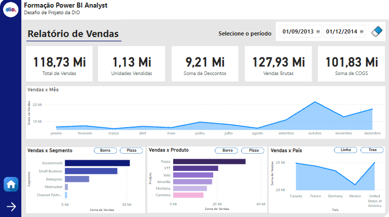
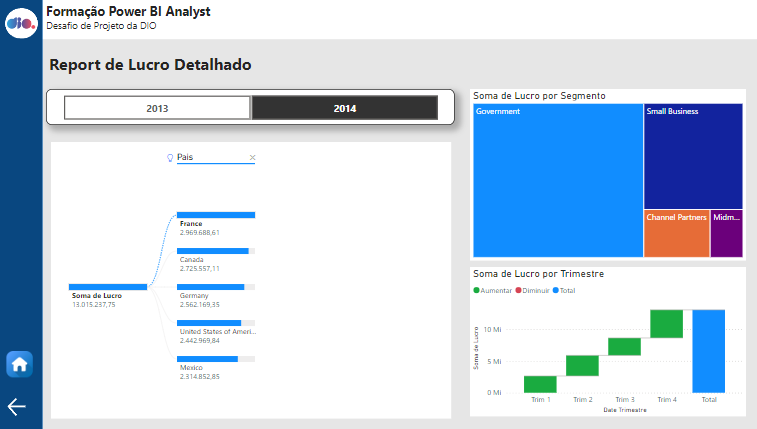

# Desafio: Criando um Relatório Gerencial de Vendas com Power BI

Bem-vindo ao repositório do desafio de Visualização e Análise de Dados com Power BI do bootcamp da DIO! Aqui, você encontrará todos os recursos e informações necessárias para criar um relatório gerencial de vendas utilizando Power BI.

## O que eu fiz

Neste desafio, criei um relatório gerencial de vendas utilizando Power BI, seguindo as instruções e boas práticas fornecidas. O relatório é composto por duas páginas principais: 

### Capa
A capa do relatório apresenta o título e informações básicas sobre o projeto, com um botão para acessar o relatório.

### Primeira Tela
A primeira tela do relatório exibe um resumo das vendas, incluindo indicadores chave e gráficos interativos.

### Segunda Tela
A segunda tela oferece uma análise detalhada dos lucros, segmentados por diferentes critérios, com gráficos que permitem uma navegação interativa.

 

## 👨‍💻 Colaboradores

<table align="center">
    <tr>
        <td align="center">
            <a href="https://github.com/theHprogrammer">
                
                 
                <b>Helder Henrique</b>
            </a>
        </td>
    </tr>
</table>
<h4 align="center">
   By: <a href="https://www.linkedin.com/in/theHprogrammer/" target="_blank"> Helder Henrique </a>, 
</h4>